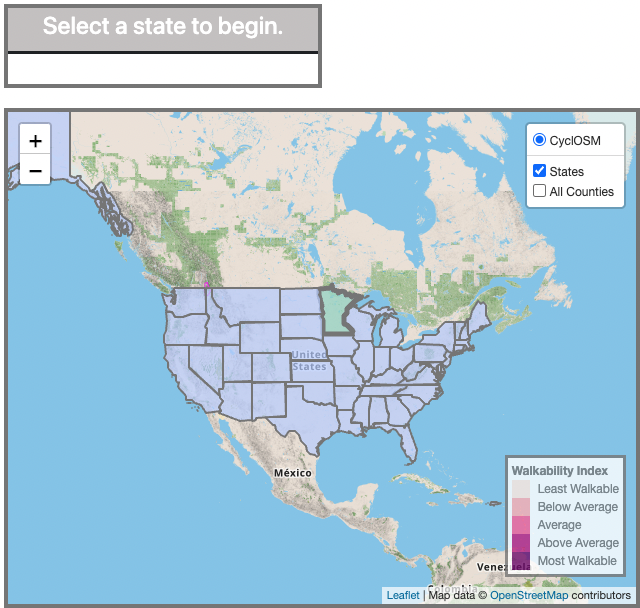
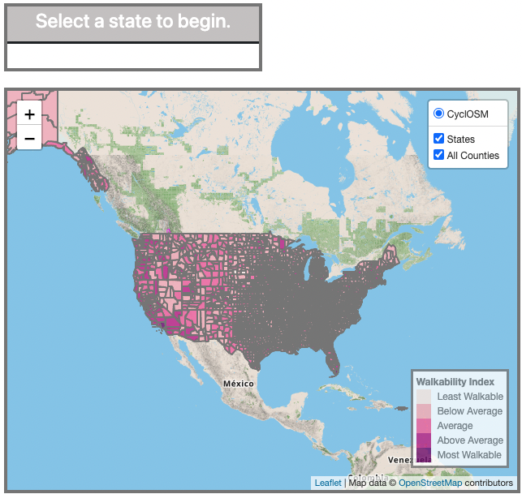
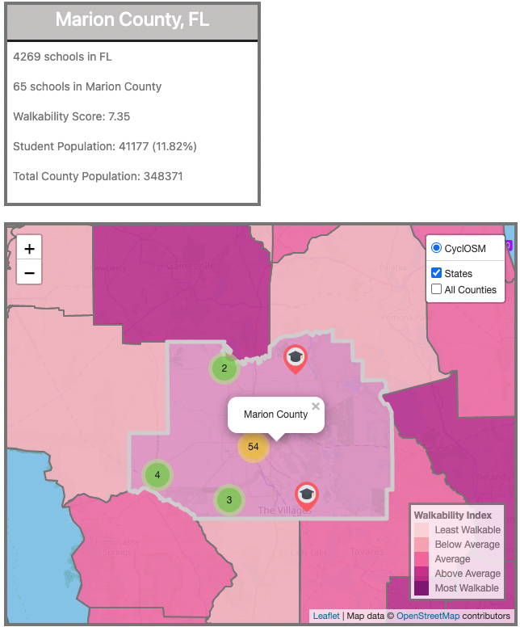
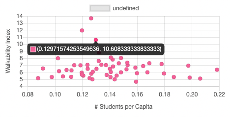
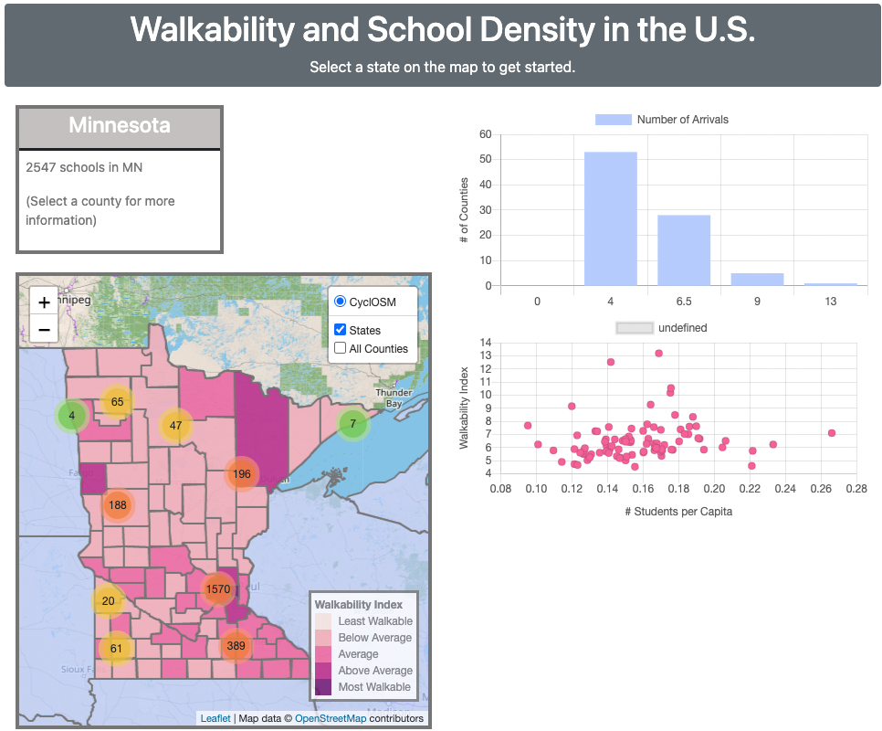

# Project3_Group4

**Project Background**

For this project we used the [Walkability Index](https://catalog.data.gov/dataset/walkability-index) data to map out all the counties and schools within a walkability range for every state within the United States.  The Goal was determine the number of schools within each county, the walkability score vs the students population for that county vs the total county population

The Walkability Index dataset characterizes every Census 2019 block group in the U.S. based on its relative walkability. Walkability depends upon characteristics of the built environment that influence the likelihood of walking being used as a mode of travel. The Walkability Index is based on the EPA's previous data product, the Smart Location Database (SLD)

Open with live server via the index.Html will show the map where user can select any state by simply clicking on the state

**Reference**
[Chart.js](https://www.chartjs.org/), 
[Walkability Index](https://catalog.data.gov/dataset/walkability-index)
